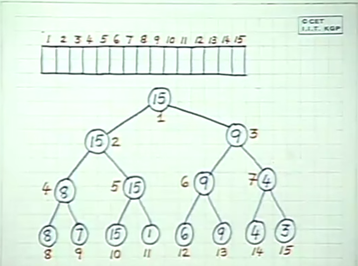
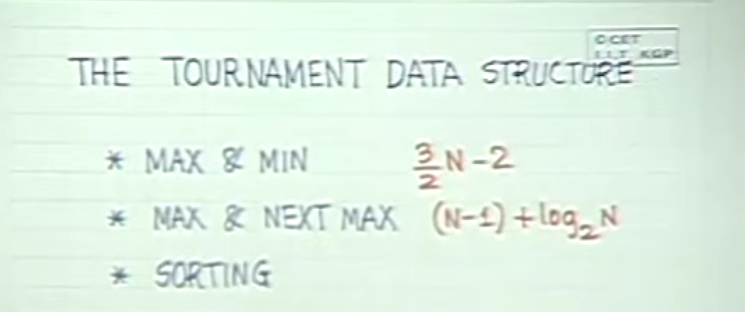
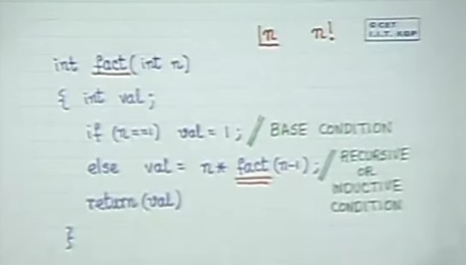

### Notes for Data Structures and Programming Methodology in C
<script type="text/javascript" src="http://cdn.mathjax.org/mathjax/latest/MathJax.js?config=default"></script>
---

Performance of Min and Max algorithm

```c
	int n, max, min, i, numb;
	printf("Give n:");
	scanf_s("%d", &n);
	printf("\n n = %d \n", n);
	scanf_s("%d", &max);
	min = max;
	for (i = 1; i < n - 1; i++)
	{
		scanf_s("%d", &numb);
		if (numb > max) max = numb;
		else if (numb < min) min = numb;
	}
```
- If the else was not present then, we do 2(n-1) comparisons
- With else we do only <= 2(n-1) comparisons
- If we do pairwise comarison, we will have only (n-1) comaprison for max
- The minimum can be computed by (n-1)/2 comparisons


A better strategy is given below

```c
#include "MaxnMin.h"

#include <stdio.h>

MaxnMin::MaxnMin()
{
	int n, m, max, min, i, numb1, numb2;

	/* READ N */
	printf("Given n :");
	scanf_s("%d", &n);
	printf("\n n = %d \n", n);

	/* INITITALIZE MAX AND MIN */
	scanf_s("%d", &max);
	min = max;
	m = n - 1;
	if (n % 2 == 0) {
		scanf_s("%d", &min);
		if (max < min) swap(&max, &min);
		m = m - 1;
	}

	/* Fill up the arrays large & small */
	for (i = 1; i < m / 2; i++) {
		scanf_s("%d%d", &numb1, &numb2);
		if (numb1 < numb2) swap(&numb1, &numb2);
		if (numb1 > max) max = numb1;
		if (numb2 < min) min = numb2;
		
	}

	/* Print the results */
	printf("\n MAX = %d, MIN = %d \n", max, min);


}
MaxnMin::~MaxnMin()
{

} 

int MaxnMin::swap( int* i, int* j) {
	int temp;
	temp = *i;
	*i = *j;
	*j = temp;
	return 0;
}
```

Let's see how we can find max as well as nextmax

```c
	int i, n, max, nextmax, numb;
	printf("Give n:");
	scanf_s("%d", &n);
	scanf_s("%d", &max);
	nextmax = max;
	if (max < nextmax) swap(max, nextmax);
	for (i = 0; i < n - 1; i++) {
		scanf_s("%d", &numb);
		if (numb > max) {
			nextmax = max;
			max = numb;
		}
		else if (numb > nextmax) nextmax = numb;
	}

	printf("\n MAX = %d, SECOND MAX = %d \n", max, nextmax);
}
```

Now let's check how we can improve the algorithm.
- Only those the set elements which are lost to the maximum needs to be compared to find the second largest
- Because the numbers which have lost to the aforementioned set of numbers are already smaller than them 


- In the above figure, only 8, 9 and 4 needs to be compared.
-  How many comparison the maximum has to take, that many comparisons are needed. It is determined by the length of the path of maximum. 
-  In the worst case, the longest path will be for the maximum and hence to minimize the number of operations, we should minimize the longest path.
-  It is minized when the tree is balanced
-  If we do only pairwise comparisons, then lenth of the path is always: log~2~n


Let us look at possible solutions





The code for the above solution is given as follows:
```c
Nextmax::Nextmax() {
	int tourn[100], i, n;
	/* READ */
	printf(" Given n: ");
	scanf_s("%d", &n);
	printf("\n n = %d \n", n);
	for (i = n; i <= 2 * n - 1; i++) {
		scanf_s("%d", &tourn[i]);
	}

	/* COMPUTE */
	for (i = 2 * n - 2; i > 1; i = i - 2)
	{
		tourn[i / 2] = maxi(tourn[i], tourn[i + 1]);
	}
				
	for (i = 1; i <= 2 * n - 1; i++)
		printf("%d ", tourn[i]);
	printf("\n");
}

Nextmax::~Nextmax() {

}

void Nextmax::swap(int& i, int& j) {
	int temp;
	temp = i;
	i = j;
	j = temp;
}

int Nextmax::maxi(int i, int j) {
	if (i > j) return(i);
	else return(j);
}
```

#### The tournament data stucture
---


- The tournament is a comparison tree
- Finding the largest nubmer will take: 
  - 3N/2 - 2 comparisons for even
  - (3/2)N - 1 comparisons for odd
- Finding the second largest number will take:
  - ceil (log<sub>2</sub> n) : height of tree or length of longest path in the tree in worst case scenario
 




#### Sorting

- Traditional Bubble Sort or exchange sort

- We can do the same with tournament data structure

- There is a data structure called HEAP which is same as a binary comparison tree but with only N elements instead of 2N - 1 elements

### Problem Decomposition

##### Factorial of a number

```c
int fact(n)
{
	int val;
	if(n==1) val=1;
	else val = n*fact(n-1);
	return(val);
}
```
- The above program is having an inductive solution. 
- We have an inductive basis and inductive condition.



#### Fibonacci Numbers


#### Towers of Hanoi/Brahma


